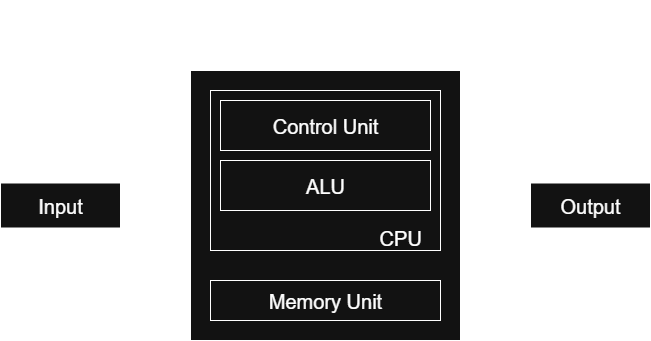
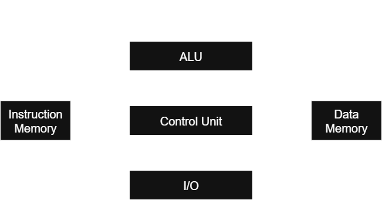

## Von Neumann and Harvard Architectures

Computer architecture defines how the CPU, memory, and input/output systems interact.
Two fundamental architectures used in processor design are the **Von Neumann architecture** and the **Harvard architecture**.
Both have distinct ways of handling **instructions** and **data**.

## Von Neumann Architecture

### Definition

The **Von Neumann architecture**, proposed by John von Neumann in 1945, is a design where **instructions and data share the same memory and bus system**.
This means program instructions and data reside in the same physical memory space.

### Key Features

1. **Single Memory for Instructions and Data**
   - Both program code and data are stored in the same memory.
2. **Single Bus System**
   - One bus is used for instruction fetches and data transfers.
3. **Sequential Execution**
   - Instructions are fetched and executed one at a time (unless pipelining is introduced).
4. **Simplicity**
   - Easier to design and cost-effective.

### Advantages

- **Simplicity of Design**: Single memory and bus make it straightforward.
- **Flexibility**: Memory can be used for either instructions or data.
- **Low Cost**: Requires fewer hardware resources.

### Disadvantages

- **Von Neumann Bottleneck**: Since instructions and data share the same bus, simultaneous access is not possible.
- **Performance Limitation**: CPU may be idle while waiting for data/instructions to be fetched.
- **Security Risk**: Data can be executed as instructions, leading to vulnerabilities (e.g., buffer overflow exploits).

## Harvard Architecture

### Definition

The **Harvard architecture** uses **separate memory spaces and buses** for instructions and data.  
This allows instructions and data to be accessed simultaneously, improving performance.

### Key Features

1. **Separate Instruction and Data Memory**
   - Program instructions and data are stored in different physical memories.
2. **Two Bus Systems**
   - Separate buses for fetching instructions and transferring data.
3. **Parallelism**
   - CPU can fetch the next instruction while simultaneously accessing data.
4. **Predictable Behavior**
   - Clear separation of code and data.

### Advantages

- **Higher Performance**: Simultaneous access to instructions and data removes the Von Neumann bottleneck.
- **Efficiency**: Parallel instruction fetch and data access speeds up execution.
- **Improved Security**: Code and data separation reduces chances of executing malicious data as code.

### Disadvantages

- **Complex Hardware Design**: Requires two separate memory and bus systems.
- **Cost**: More expensive compared to Von Neumann systems.
- **Inflexibility**: Instruction memory cannot be used for data and vice versa.

## Example Use Cases

- **Von Neumann Architecture**

  - General-purpose computers (desktops, laptops, servers).
  - Systems where cost and simplicity are more important than speed.

- **Harvard Architecture**
  - Microcontrollers (e.g., ARM Cortex-M, PIC, AVR).
  - DSPs (Digital Signal Processors).
  - Embedded systems where performance and predictability are critical.

## Visual Representation

## Conclusion

- **Von Neumann Architecture**: Simple, flexible, and widely used in general-purpose computing but limited by the **Von Neumann bottleneck**.
- **Harvard Architecture**: Faster and more efficient due to separate paths for instructions and data but more complex and costly.

Modern processors often use a **Modified Harvard Architecture** — instructions and data have separate caches but may share a common memory further down, balancing **performance** with **cost and flexibility**.
