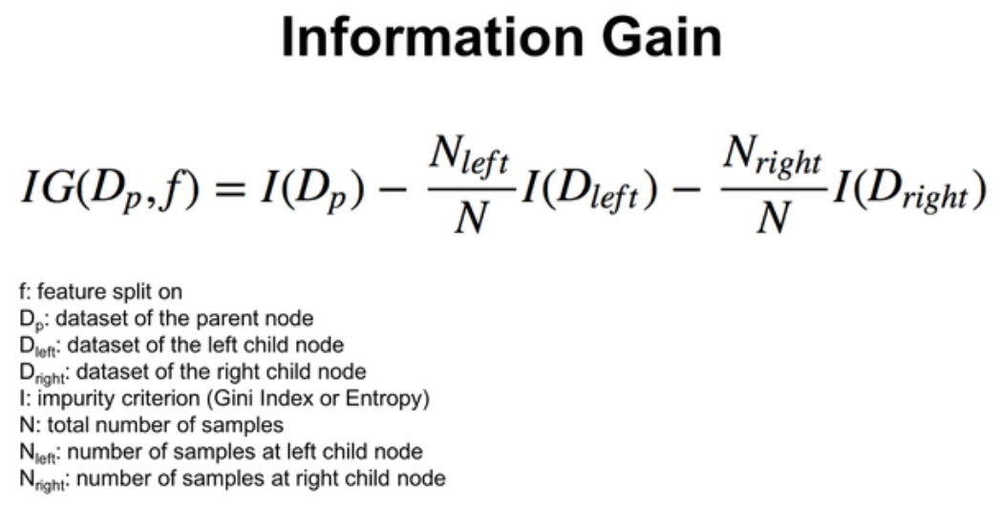

# Decision Trees

## What is a Decision Tree?

A **Decision Tree** is a supervised machine learning algorithm used for
**classification and regression** tasks.

It works by **splitting data into smaller and smaller groups** based on
conditions, forming a tree-like structure of decisions.

Can be visualized as a **flowchart** where each decision leads you closer to the final answer.

---

## Real-Life Analogy

Imagine deciding whether to **play cricket**:

- Is it raining?
  - Yes → Don’t play
  - No → Is it too hot?
    - Yes → Play in evening
    - No → Play now

This step-by-step questioning is exactly how a **decision tree works**.

---

## Structure of a Decision Tree

A decision tree has the following components:

### Root Node

- The topmost node
- Represents the **entire dataset**
- First decision is made here

### Internal Nodes

- Represent **conditions/tests**
- Example: `Age > 30?`

### Branches

- Outcomes of decisions
- Connect nodes

### Leaf Nodes (Terminal Nodes)

- Final output
- Class label (classification) or value (regression)

---

## How Decision Trees Work

Decision trees work by **recursively splitting the dataset**
based on the feature that gives the **best separation**.

### Goal:

Create groups that are as **pure as possible**.

> Pure = Most data points belong to the same class

---

## Key Concept: Impurity

Before splitting, the algorithm measures how **mixed** the data is.

### Common Impurity Measures

#### 1. Gini Impurity

[Detailed Description](DOCS/CLASSICAL_ML/Gini_Impurity.md)

- Measures how often a randomly chosen element would be misclassified
- Lower value = better split

---

#### 2. Entropy

[Detailed Description](DOCS/CLASSICAL_ML/Entropy.md)

- Measures randomness or uncertainty
- Lower entropy = more pure

---

## How Training Works (Step-by-Step)

### Step 1: Start with Full Dataset

- This becomes the **root node**

---

### Step 2: Try All Possible Splits

For each feature:

- Try different split conditions
- Example:
  - `Age < 25`
  - `Income > 50K`

---

### Step 3: Calculate Impurity

- Compute impurity **before and after split**
- Choose split that gives **maximum information gain**

---

### Step 4: Split the Data

- Divide dataset into subsets
- Each subset becomes a child node

---

### Step 5: Repeat Recursively

- Apply same process to each child node
- Continue until stopping condition is met

---

### Step 6: Stop When

- All data is pure OR
- Maximum depth reached OR
- Minimum samples per node reached

---

## What is Information Gain?

Information Gain tells us how much **uncertainty is reduced** after a split.



- Higher IG = better split

---

## Simple Example

Dataset: Predict **Pass/Fail**

| Hours Studied | Result |
| ------------- | ------ |
| 2             | Fail   |
| 4             | Fail   |
| 6             | Pass   |
| 8             | Pass   |

Tree might learn:

- If `Hours < 5` → Fail
- Else → Pass

---

## How Inference Works (Prediction Phase)

Once the tree is trained:

1. Start at **root node**
2. Check condition
3. Follow branch
4. Repeat until leaf node
5. Output result

> It’s just a sequence of **if-else statements**

---

## Decision Tree as Code (Conceptually)

```c
if (hours < 5)
    return "Fail";
else
    return "Pass";
```
