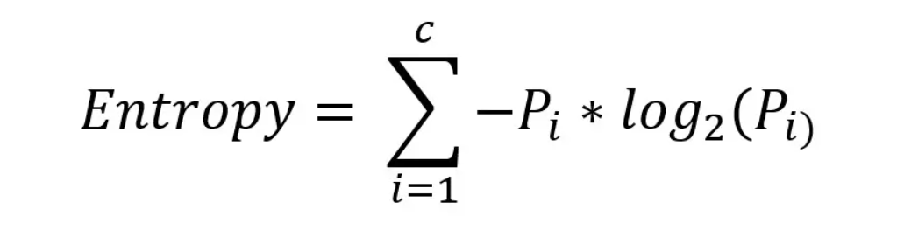
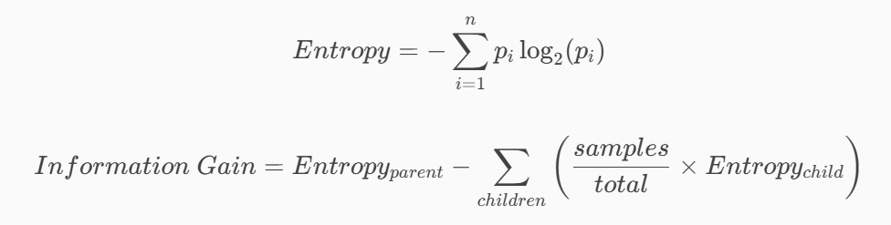

## Entropy (Detailed Explanation)

### What is Entropy?

**Entropy** measures the **uncertainty or randomness** in a dataset.

It answers the question: **"How unpredictable is this data?"**

- **Low Entropy (≈ 0)** → Data is pure (predictable)
- **High Entropy (≈ 1 for binary)** → Data is highly mixed (uncertain)

---

### Mathematical Definition

Where:

- \( p*i \) = probability of class \_i*
- \( C \) = number of classes

---

### Intuition Behind the Formula

Let’s understand it step-by-step:

- \( log_2(p_i) \) → measures **information content**
- Rare events → higher information
- Common events → lower information

- The negative sign ensures:
  - Entropy is always **positive**
  - Higher randomness → higher value

> Entropy tells us how much **"surprise"** is in the data

---

### Real-Life Intuition

- If a coin always gives **Heads** → No surprise → Entropy = 0
- If a coin is perfectly random → Maximum surprise → High Entropy

---

### Simple Example (Step-by-Step)

#### Case 1: Perfectly Pure Node

| Class | Count |
| ----- | ----- |
| Pass  | 10    |
| Fail  | 0     |

- \( p*{pass} = 1 \), \( p*{fail} = 0 \)

\[
H = -(1 \cdot \log_2 1 + 0 \cdot \log_2 0) = 0
\]

✅ **Entropy = 0 → No uncertainty**

---

#### Case 2: Completely Mixed Node

| Class | Count |
| ----- | ----- |
| Pass  | 5     |
| Fail  | 5     |

- \( p*{pass} = 0.5 \), \( p*{fail} = 0.5 \)

\[
H = -(0.5 \log_2 0.5 + 0.5 \log_2 0.5) = 1
\]

⚠️ **Entropy = 1 → Maximum uncertainty (binary case)**

---

#### Case 3: Slightly Mixed

| Class | Count |
| ----- | ----- |
| Pass  | 8     |
| Fail  | 2     |

- \( p*{pass} = 0.8 \), \( p*{fail} = 0.2 \)

\[
H = -(0.8 \log_2 0.8 + 0.2 \log_2 0.2) \approx 0.72
\]

👍 Less uncertainty than 1, but not fully pure

---

### Visual Understanding

- **0 → Completely certain**
- **1 → Completely uncertain (binary case)**

> Goal of decision tree:
> **Reduce entropy at every split**

---

### How Entropy is Used in Decision Trees

At each step:

1. Compute entropy of current dataset
2. Try all possible splits
3. Measure how much entropy is reduced
4. Choose split with **maximum reduction**

---

## Information Gain (Core Concept)

Entropy alone is not enough—we use **Information Gain (IG)**

---

### What is Information Gain?

- Measures how much **uncertainty is reduced**
- Higher IG = better split

---

### Example of Split Decision

#### Before Split:

- Entropy = 1 (high uncertainty)

---

#### Split A:

- Left node Entropy = 0.2 (70 samples)
- Right node Entropy = 0.3 (30 samples)

\[
H = (70/100)*0.2 + (30/100)*0.3 = 0.23
\]

\[
IG = 1 - 0.23 = 0.77
\]

---

#### Split B:

- Both nodes Entropy = 0.5

\[
H = 0.5
\]

\[
IG = 1 - 0.5 = 0.5
\]

---

✅ **Split A is better (higher information gain)**

---

### Why Entropy Works

- Based on **Information Theory**
- Captures uncertainty very accurately
- Penalizes mixed distributions more strongly than Gini

---

### Entropy vs Gini (Quick Insight)

| Feature        | Entropy        | Gini              |
| -------------- | -------------- | ----------------- |
| Interpretation | Uncertainty    | Misclassification |
| Range (binary) | 0 to 1         | 0 to 0.5          |
| Computation    | Slower (log)   | Faster            |
| Sensitivity    | More sensitive | Slightly less     |

> Both are widely used and often give similar results

---

### Practical Usage

Used in many implementations including:

- ID3 Algorithm (pure entropy-based tree)

---

### Conclusion

- Entropy measures **uncertainty**
- Higher entropy = more randomness
- Decision trees aim to **reduce entropy**
- Information Gain helps choose best splits

---
