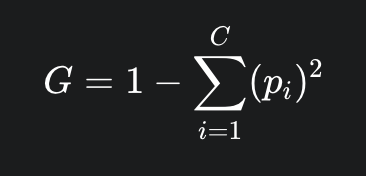
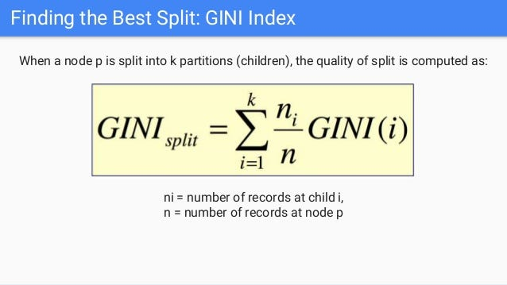

## Gini Impurity (Detailed Explanation)

### What is Gini Impurity?

**Gini Impurity** measures how **impure (mixed)** a dataset is.

> It answers the question:
> **"If I randomly pick a data point, how likely am I to classify it incorrectly?"**

- **Low Gini (≈ 0)** → Data is pure (mostly one class)
- **High Gini (≈ 0.5 for binary)** → Data is mixed

---

### Mathematical Definition

:contentReference[oaicite:0]{index=0}

Where:

- \( p*i \) = probability of class \_i*
- \( C \) = number of classes

---

### Intuition Behind the Formula

Let’s break it down:

- \( p*i^2 \) → probability of correctly classifying class \_i*
- Sum of all \( p_i^2 \) → total probability of correct classification
- \( 1 - \text{that} \) → probability of **misclassification**

> So Gini directly measures **chance of making a wrong decision**

---

### Simple Example (Step-by-Step)

#### Case 1: Perfectly Pure Node

| Class | Count |
| ----- | ----- |
| Pass  | 10    |
| Fail  | 0     |

- \( p*{pass} = 1 \), \( p*{fail} = 0 \)

\[
G = 1 - (1^2 + 0^2) = 0
\]

✅ **Gini = 0 → Perfect split**

---

#### Case 2: Completely Mixed Node

| Class | Count |
| ----- | ----- |
| Pass  | 5     |
| Fail  | 5     |

- \( p*{pass} = 0.5 \), \( p*{fail} = 0.5 \)

\[
G = 1 - (0.5^2 + 0.5^2) = 0.5
\]

⚠️ **Gini = 0.5 → Worst case (maximum impurity)**

---

#### Case 3: Slightly Mixed

| Class | Count |
| ----- | ----- |
| Pass  | 8     |
| Fail  | 2     |

- \( p*{pass} = 0.8 \), \( p*{fail} = 0.2 \)

\[
G = 1 - (0.8^2 + 0.2^2) = 1 - (0.64 + 0.04) = 0.32
\]

👍 Better than 0.5, but not perfect

---

### Visual Understanding

Think of Gini like this:

- **0.0 → Fully clean (pure)**
- **0.5 → Totally confused (for binary classes)**

The goal of the tree:

> **Reduce Gini at every split**

---

### How Gini is Used in Decision Trees

At each step:

1. Try all possible splits
2. Compute Gini for each split
3. Choose the split with **lowest weighted Gini**

---

### Weighted Gini After Split

Where:

- \( n_i \) = samples in child node
- \( n \) = total samples
- \( GINI(i) \) = Gini of child node

---

### Example of Split Decision

Suppose:

#### Split A:

- Left node Gini = 0.1 (70 samples)
- Right node Gini = 0.2 (30 samples)

\[
G = (70/100)*0.1 + (30/100)*0.2 = 0.13
\]

---

#### Split B:

- Left node Gini = 0.3
- Right node Gini = 0.3

\[
G = 0.3
\]

---

✅ **Split A is better (lower Gini)**

---

### Why Gini Works So Well

- Very fast to compute (no logarithms like entropy)
- Works well in practice
- Default choice in many libraries

---

### Gini vs Entropy (Quick Insight)

| Feature     | Gini    | Entropy   |
| ----------- | ------- | --------- |
| Speed       | Faster  | Slower    |
| Math        | Simple  | Log-based |
| Performance | Similar | Similar   |

> In practice, both give very similar results

---

### Conclusion

- Gini measures **impurity (disorder)**
- Lower Gini = better split
- Decision Trees try to **minimize Gini at every step**
- It represents **probability of wrong classification**

---
