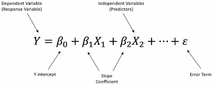
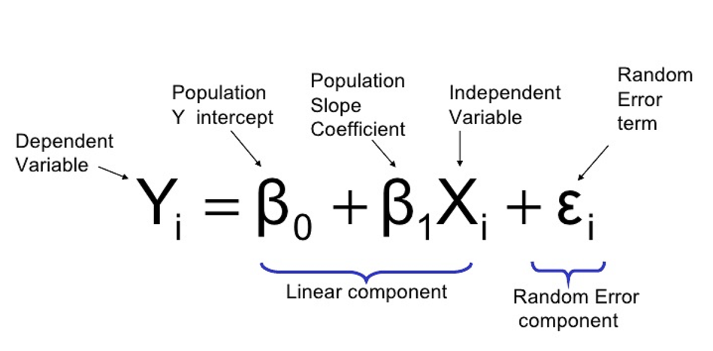
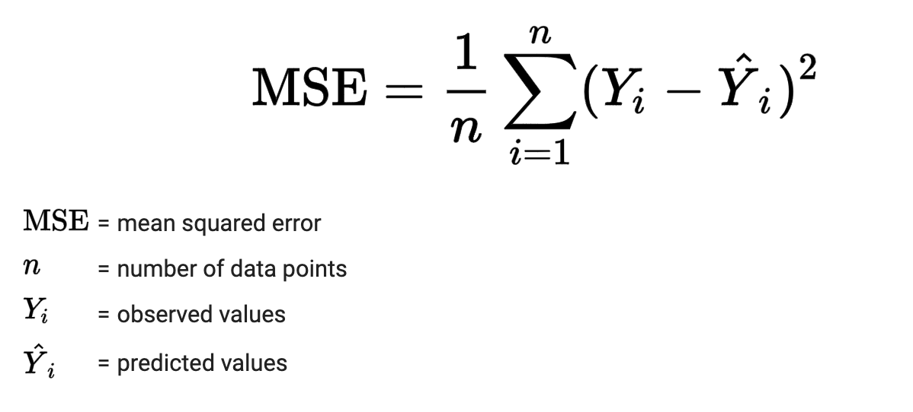
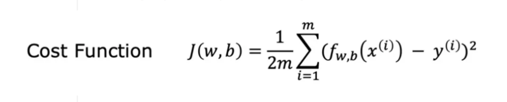
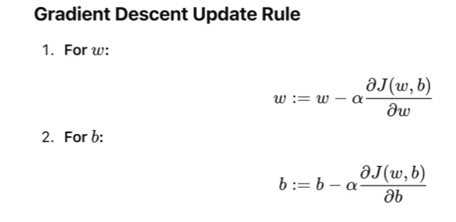
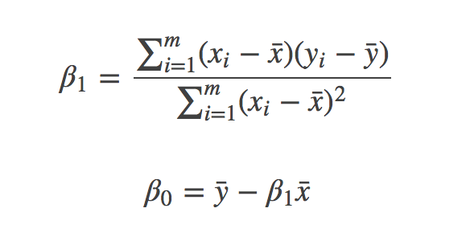
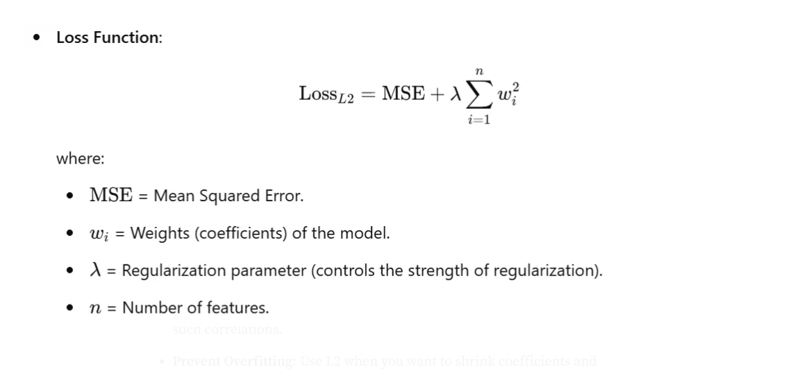
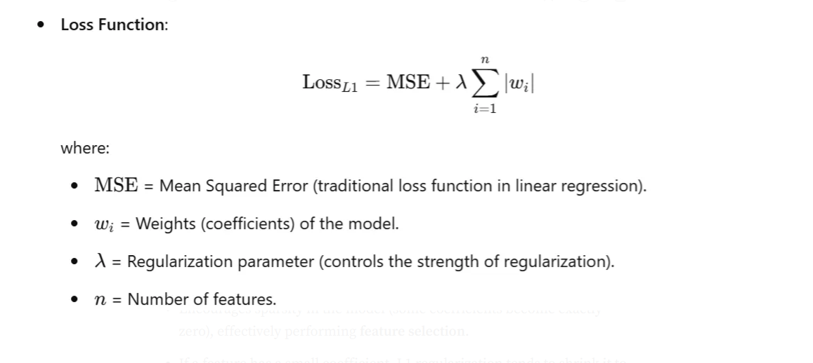
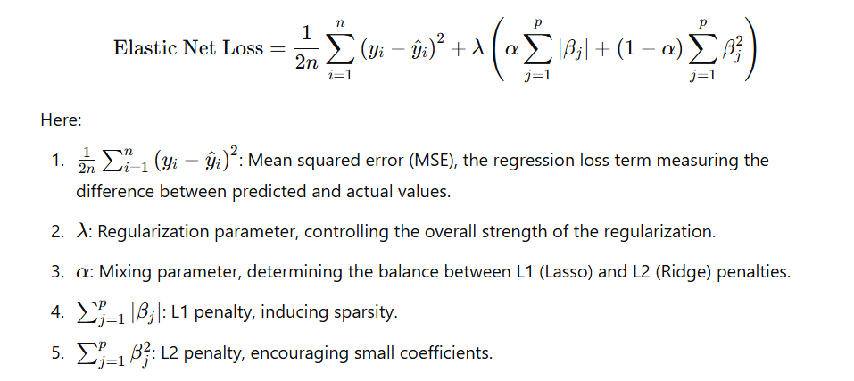
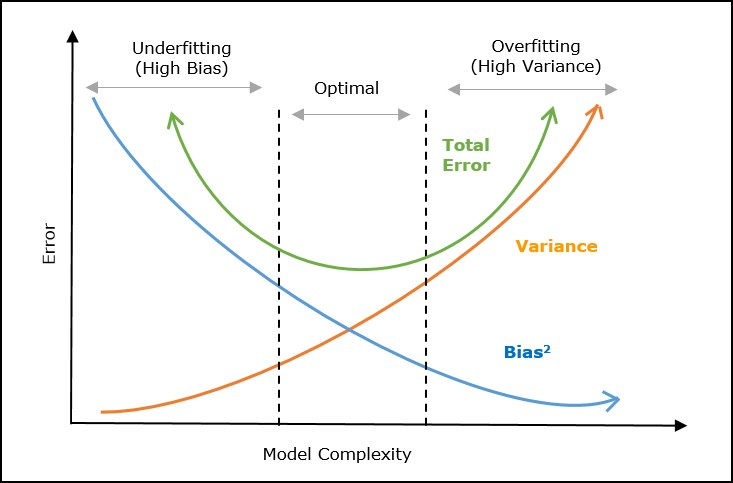

# Regression

## What is Regression?

**Regression** is a supervised learning technique used to predict
**continuous numerical outputs** from input features.

Objective is to learn a function that maps inputs → continuous output

---

## Problem Setup

We are given:

- Input features: \( X = [x_1, x_2, ..., x_n] \)
- Target variable: \( y \)

We want to learn a function:



---

## Linear Regression

## Core Idea

Linear Regression assumes a **linear relationship** between inputs and output.



---

## Geometric Interpretation

- In 2D → Line
- In 3D → Plane
- In higher dimensions → **Hyperplane**

> The model tries to find the best hyperplane that fits the data

---

## Objective: Minimize Error

We measure error using **Mean Squared Error (MSE)**



---

## Why Squared Error?

- Penalizes large errors more
- Smooth and differentiable → easy optimization

---

## Training Methods

### Gradient Descent

Cost Function:



Update Rule:



---

### Step-by-Step Training

1. Initialize weights randomly
2. Compute predictions
3. Calculate error
4. Compute gradients
5. Update weights
6. Repeat until convergence

---

### 2. Normal Equation (Closed Form)



- Direct solution (no iteration)
- Expensive for large datasets

---

## Inference

Prediction is simple:

```c
y = w1*x1 + w2*x2 + ... + wn*xn + b;
```

## Assumptions of Linear Regression

- Linearity
- Independence of errors
- Homoscedasticity (constant variance)
- No multicollinearity
- Normally distributed errors

## Problems with Linear Regression

- Overfitting
- Multicollinearity
- Sensitive to outliers

## Regularization (Solution to Overfitting)

### Idea

Add a penalty term to prevent large weights.

- Ridge Regression
- Lasso Regression

## Ridge Regression (L2 Regularization)

### Definition

L2 regularization adds a penalty proportional to the squared value of the
coefficients to the loss function.

### Loss Function


​

### Intuition

- Penalizes large weights
- Distributes importance across features
- Keeps all features

### Geometric Insight

- Constraint region = circle (L2 norm)
- Solution lies where error surface touches constraint

### Behavior

- Shrinks weights smoothly
- Never becomes exactly zero

### When to Use

- Many correlated features
- Want stable predictions

## Lasso Regression (L1 Regularization)

### Definition

L1 regularization adds a penalty proportional to the absolute value of the
coefficients to the loss function.

### Loss Function



### Intuition

- Forces some weights to exactly zero
- Performs feature selection

### Geometric Insight

- Constraint region = diamond (L1 norm)
- Corners encourage sparsity

### Behavior

- Sparse model
- Automatically removes irrelevant features

### When to Use

- High-dimensional data
- Feature selection needed

## Elastic Net Regression

**Elastic Net Regression** is a combination of **Ridge (L2)** and **Lasso (L1)** regularization.

> It combines the strengths of both:
>
> - Ridge → stability
> - Lasso → feature selection

---

### Why Do We Need Elastic Net?

### Problem with Ridge

- Keeps all features
- Cannot perform feature selection

### Problem with Lasso

- Can behave unpredictably when:
  - Features are highly correlated
  - May select one feature and ignore others randomly

---

### Solution: Elastic Net

> Elastic Net balances both behaviors:
>
> - Selects features (like Lasso)
> - Handles correlation (like Ridge)

### Mathematical Formulation



### When to Use Elastic Net

- Many features are correlated
- Need both stability and feature selection
- Dataset has high dimensionality

### When to avoid Elastic Net

- Very small datasets
- Simple linear relationships

## Ridge vs Lasso vs Elastic Net

| Feature             | Ridge | Lasso  | Elastic Net |
| ------------------- | ----- | ------ | ----------- |
| Regularization      | L2    | L1     | L1 + L2     |
| Feature Selection   | No    | Yes    | Yes         |
| Stability           | High  | Medium | High        |
| Correlated Features | Good  | Poor   | Excellent   |

## Bias, Variance, and the Tradeoff

When building regression models, we don’t just care about fitting the training data.
We care about how well the model performs on **unseen data**

This is where **Bias** and **Variance** come in.

---

### What is Bias?

**Bias** measures how much a model’s predictions differ from the true values
due to **oversimplified assumptions**.

> High Bias → Model is too simple → Misses patterns

---

#### Example

Trying to fit a straight line to a curved dataset:

- Model cannot capture the true relationship
- Predictions are consistently wrong

---

#### Characteristics of High Bias

- Underfitting
- Poor performance on both training and test data
- Model too simple

---

### What is Variance?

**Variance** measures how much the model’s predictions change
when trained on different datasets.

> High Variance → Model is too sensitive → Learns noise

---

#### Example

A very complex model:

- Fits training data perfectly
- But fails on new data

---

#### Characteristics of High Variance

- Overfitting
- Very low training error
- High test error

---

### Visual Intuition

| Case          | Behavior               |
| ------------- | ---------------------- |
| High Bias     | Too simple (underfits) |
| High Variance | Too complex (overfits) |
| Balanced      | Generalizes well       |

---

### The Tradeoff

> We cannot minimize both bias and variance at the same time

- Reducing bias → increases variance
- Reducing variance → increases bias

## 

### In Context of Regression Models

#### Linear Regression

- **Bias**: Moderate (assumes linear relationship)
- **Variance**: Can be high (especially with many features)

---

#### Ridge Regression

- Adds L2 penalty

**Effect:**

- Slightly increases bias
- Reduces variance significantly

> Leads to more stable predictions

---

#### Lasso Regression

- Adds L1 penalty

**Effect:**

- Increases bias
- Reduces variance
- Also removes features (sparsity)

---

### Elastic Net

- Combines L1 + L2

**Effect:**

- Balanced bias increase
- Strong variance reduction
- Handles correlated features well

---

### Intuition Summary

| Model             | Bias        | Variance |
| ----------------- | ----------- | -------- |
| Linear Regression | Medium      | High     |
| Ridge             | Medium-High | Low      |
| Lasso             | High        | Low      |
| Elastic Net       | Balanced    | Low      |

---

### Graphical Understanding (Conceptual)

- Simple model → High Bias, Low Variance
- Complex model → Low Bias, High Variance
- Regularization → Moves toward balance

---

### Role of Regularization (λ)

- Small λ → Low bias, high variance
- Large λ → High bias, low variance

> Choosing λ properly is critical

---

### How to Find the Right Balance

#### 1. Cross-Validation

- Split data into multiple folds
- Train and validate
- Choose model with best generalization

---

#### 2. Learning Curves

- Plot training vs validation error
- Diagnose:
  - High bias → both errors high
  - High variance → gap between errors

---

### Practical Insight

#### If Model is Underfitting (High Bias)

- Increase model complexity
- Add features
- Reduce regularization

---

#### If Model is Overfitting (High Variance)

- Increase regularization
- Reduce features
- Use Ridge/Lasso/Elastic Net
