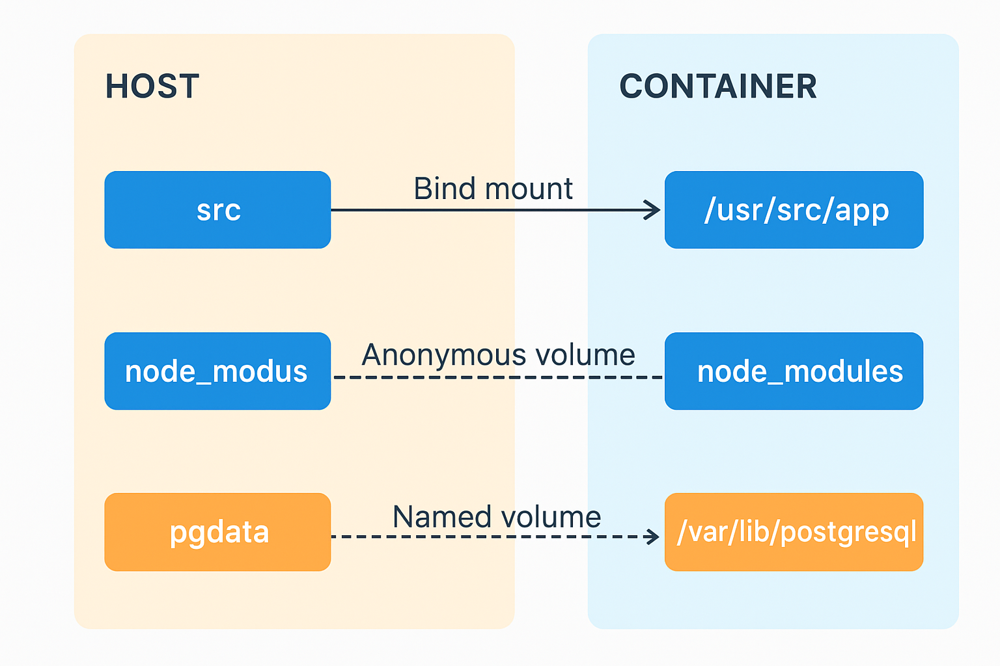

## Docker Storage Use Cases: Bind Mounts, Named Volumes, and Anonymous Volumes

When working with Docker containers, **data persistence** and **data sharing** are critical. Containers are ephemeral by nature — once removed, any data stored inside is lost.  
To solve this, Docker provides three main ways to manage persistent data:

1. **Bind Mounts**
2. **Named Volumes**
3. **Anonymous Volumes**

## Bind Mounts

### What it is

- A **direct link between a host directory/file** and a container directory.
- Path on host must be **explicitly defined**.
- Provides full control but tightly couples container to host filesystem.

### Example Use Case

You are developing a **Node.js app** and want real-time code changes inside the container without rebuilding.

```bash
docker run -it --name node-dev \
  -v $(pwd):/usr/src/app \
  -w /usr/src/app \
  node:18 node server.js
```

## Named Volumes

- Docker-managed volumes stored under /var/lib/docker/volumes/.
- Named by the user (e.g., mydata).
- Decoupled from host paths → more portable.

### Example Use Case

We are running a PostgreSQL database in production and want persistent storage across container restarts.

```bash
docker volume create pgdata

docker run -d --name postgres-db \
  -e POSTGRES_PASSWORD=mysecret \
  -v pgdata:/var/lib/postgresql/data \
  postgres:16

```

- pgdata is a Docker-managed volume.
- Data persists even if the container is removed and replaced.
- Easier to back up (docker run --rm -v pgdata:/data busybox tar -czf /backup/pg.tar.gz /data).

## Anonymous Volumes

Like named volumes but Docker assigns a random name.
Useful when persistence is needed but naming isn’t important.
Often created automatically when image VOLUME instruction is used.

### Example Use Case

We run a temporary MySQL container for testing, and don’t care about reusing data later.

```bash
docker run -d --name mysql-temp \
  -e MYSQL_ROOT_PASSWORD=root \
  -v /var/lib/mysql \
  mysql:8
```

- Docker creates an anonymous volume with a random name.
- Data persists while the container exists.
- When container is deleted with docker rm -v, the volume is also deleted.

## Why and when to use all three?

Let's say following is a web application stack

```yaml
version: "3.9"
services:
  app:
    image: node:18
    container_name: web-app
    working_dir: /usr/src/app
    command: npm start
    volumes:
      # Bind mount → source code on host mapped into container for live development
      - ./src:/usr/src/app
      # Anonymous volume → prevent overwriting node_modules when mounting ./src
      - /usr/src/app/node_modules
    ports:
      - "3000:3000"

  db:
    image: postgres:16
    container_name: postgres-db
    environment:
      POSTGRES_PASSWORD: mysecret
    volumes:
      # Named volume → persist database data across restarts
      - pgdata:/var/lib/postgresql/data

volumes:
  pgdata:
```

Following is how Named, Anonymous Volumes and Bind Mounts have a use in this application:

- Bind Mount (./src → /usr/src/app)

  - Developers can edit code on the host.
  - Changes immediately appear in the container (no rebuild needed).
  - Perfect for fast dev cycles.

- Anonymous Volume (/usr/src/app/node_modules)

  - Prevents host ./src/node_modules (if exists) from overwriting the container’s installed dependencies.
  - Docker assigns a random volume name, used only while this container exists.
  - Good for isolating build artifacts without cluttering the host.

- Named Volume (pgdata)

  - PostgreSQL database persists data across container restarts/replacements.
  - Easy to back up, restore, or move between environments.
  - Ideal for production persistence.

### Visual Representation

Following is how it actually works:



### Commands to Run the Setup

- Create the Named Volume (for PostgreSQL persistence)

```bash
docker volume create pgdata
```

- Run the PostgreSQL Container (with Named Volume)

```bash
docker run -d \
  --name postgres-db \
  -e POSTGRES_PASSWORD=mysecret \
  -v pgdata:/var/lib/postgresql/data \
  postgres:16
```

- Run the Node.js App Container

```bash
docker run -d \
  --name web-app \
  -w /usr/src/app \
  -p 3000:3000 \
  -v $(pwd)/src:/usr/src/app \
  -v /usr/src/app/node_modules \
  node:18 \
  npm start
```

## Some useful Commands

- List Volumes

```bash
docker volume ls
```

- Create a named volume

```bash
docker volume create mydata
```

- Create with options (e.g., label, driver)

```bash
docker volume create --label env=prod mydata
```

- Inspect Volumes

```bash
docker volume inspect mydata
```

- Mount named volume

```bash
docker run -d --name db \
  -v mydata:/var/lib/mysql \
  mysql:8
```

- Mount anonymous volume (Docker auto-generates name)

```bash
docker run -d --name tempdb \
  -v /var/lib/mysql \
  mysql:8
```

- Browse Data Inside a Volume

```bash
# Run the container first in interactive mode
docker run -it --rm \
  -v mydata:/data \
  busybox sh

ls /data
```

- Remove Volumes

```bash
docker volume rm mydata
```

- Remove all unused (dangling) volumes

```bash
docker volume prune
```
