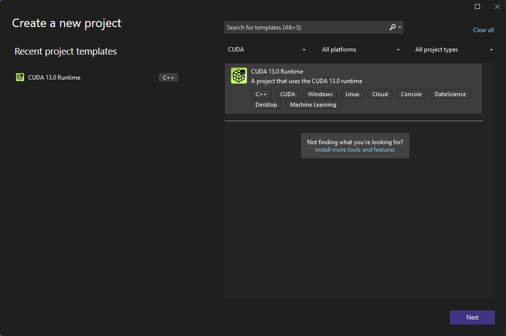

## Prerequisites

Before installing CUDA, make sure your system meets the following requirements:

- **Laptop/GPU GPU** → NVIDIA RTX 3050 (supports CUDA Compute Capability 8.6) for Example
- **Operating System** → Windows 10/11 (64-bit) or Ubuntu 20.04/22.04 (Recommended for Linux users)
- **RAM** → At least 8 GB (16 GB Preferred)
- **Storage** → ~5–10 GB free for CUDA toolkit and drivers
- **Compiler** → GCC (Linux) or MSVC (Windows)

## Install NVIDIA Drivers and Support Drivers

### On Windows

1.  Go to [NVIDIA Drivers Download](https://www.nvidia.com/Download/index.aspx).
2.  Example Selection:
    - **Product Series**: GeForce RTX 30 Series (Laptop)
    - **Product**: GeForce RTX 3050 Laptop GPU
    - **OS**: Windows 10/11 64-bit
3.  Download and install the **Game Ready Driver (GRD)** or **Studio Driver**.
4.  Install Microsoft Visual Studio Build Tools:

    - cl.exe is part of Microsoft Visual Studio. If you don't have Visual Studio or the Build Tools installed, download and install them from the official Microsoft website.
      During installation, ensure you select the "Desktop development with C++" workload, as this includes the necessary C++ compiler components.
      Locate cl.exe:
      After installation, cl.exe is typically found within a path similar to the following:

          C:\Program Files (x86)\Microsoft Visual Studio\<version>\VC\Tools\MSVC\<toolset_version>\bin\HostX64\x64

    - Add cl.exe's path to the System PATH Environment Variable.

5.  Reboot after installation.

### On Linux (Ubuntu)

```bash
sudo apt update
sudo ubuntu-drivers autoinstall
```

Verify driver installation:

```bash
nvidia-smi
```

You should see your RTX 3050 listed with driver and CUDA version.

## Install CUDA Toolkit

### Download

- Visit [CUDA Toolkit Downloads](https://developer.nvidia.com/cuda-downloads).
- Select your OS, architecture, and version (e.g., CUDA 13.x).

### Windows Installation

1. Run the installer → choose **Express Installation**.
2. Ensure CUDA Toolkit, Drivers, and Nsight tools are selected.
3. Add CUDA paths manually if needed:
   - Add to **Environment Variables → Path**:
     ```
     C:\Program Files\NVIDIA GPU Computing Toolkit\CUDA\v13.x\bin
     ```

### Ubuntu Installation

```bash
# Example for CUDA 12.2
wget https://developer.download.nvidia.com/compute/cuda/12.2.2/local_installers/cuda_12.2.2_535.54.03_linux.run
sudo sh cuda_12.2.2_535.54.03_linux.run
```

!> Version might be different, follow the Download **[LINK](https://developer.nvidia.com/cuda-downloads)** for accurate command.

Update Environment Variables:

```bash
echo 'export PATH=/usr/local/cuda/bin:$PATH' >> ~/.bashrc
echo 'export LD_LIBRARY_PATH=/usr/local/cuda/lib64:$LD_LIBRARY_PATH' >> ~/.bashrc
source ~/.bashrc
```

### Verify CUDA Installation

Run:

```bash
nvcc --version
```

Installed CUDA version should be visible.

Check GPU status with the following Command:

```bash
nvidia-smi
```

---

## Install cuDNN (Optional, for Deep Learning)

1. Go to [NVIDIA cuDNN Download](https://developer.nvidia.com/cudnn).
2. Sign in with NVIDIA Developer account.
3. Download version matching your CUDA installation.
4. Extract and copy files into CUDA directories:

Linux:

```bash
tar -xzvf cudnn-*-linux-x64-v*.tgz
sudo cp cuda/include/* /usr/local/cuda/include/
sudo cp cuda/lib64/* /usr/local/cuda/lib64/
```

Windows → Copy `bin`, `include`, and `lib` files into corresponding CUDA folders.

## Write & Run Your First CUDA Program (Command Line Compilation)

Create a simple **Program that prints Block ID, Thread ID and Warp ID**:

```cpp
/* ==================================================================================
# A simple Program to print Block(Thread Block) ID, Thread ID and warp ID
===================================================================================*/

#include <cuda_runtime.h>
#include <device_launch_parameters.h>

#include <stdio.h>

/* Kernel Function : To be executed in GPU not CPU */
__global__ void test_01() {

	int warpID = 0;
	warpID = threadIdx.x / 32;
	/* Print the Blocks and Threads IDs */
	printf("\nThe Block ID is %d --- The Thread ID is %d --- The warp ID %d", blockIdx.x, threadIdx.x, warpID);
}

/* CUDA C always requires a main Function */
int main() {
	/* Kernel_Name <<< Number_of_Blocks, Number_of_Threads_per_Block >>> */
	test_01 << <2, 64 >> > ();
	/* Note: Please note that if the thread per block count is over 1024 then the
			 application will not work as the GPU might be limited to 1024 threads per block.
			 In case we want to do a vector addition of 2048 size then we will need 2 blocks
			 of 1024 threads each to compute the sum in parallel */
			 /* Note: Also note that the number of Blocks that we can use in a application is also
					 limited, the maximum number of blocks we can use in a kernel call is limited
					 by the number of SMs in the GPU and the number of blocks per SM in the GPU
					 If a GPU has 32 blocks per SM and 10 SMs total then we can only use a maximum
					 of 320 Blocks */

					 /* The Below Function is used make the CPU wait until all the GPU operations are executed */
	cudaDeviceSynchronize();
}
```

Compile & Run:

```bash
nvcc <fileName>.cu -o out
./out
```

## Write & Run Your First CUDA Program (Using Visual Studio)

Creating a New CUDA Project in Visual Studio

- Open Visual Studio
- Create a New Project
  - Go to File → New → Project.
  - Search for “CUDA” in the templates.
- Select CUDA 12.3 Runtime (version may differ based on toolkit).
- Click Next.
  
- Configure the Project
  - Project Name: <Project_Name>
  - Location: Choose desired folder.
- Click Create.

Visual Studio automatically creates a CUDA project structure include an example program.

## Quick Reference Commands

```bash
nvidia-smi          # GPU status
nvcc --version      # CUDA version
```
